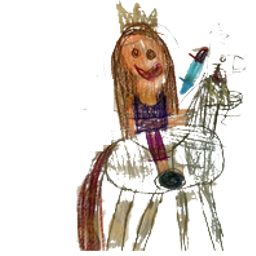

# PrincessOnUnicorn

PrincessOnUnicorn is a side-scrolling runner inspired by the Chrome offline T‑Rex game, starring a brave princess riding a unicorn.

## Features
- Medieval themed interface.
- Start menu disappears once the game begins.
- Three levels, including a boss fight against the Black Knight and an enchanted run through Unicornolandia.

## Differences from Mario
- Endless runner rather than a traditional platformer.
- One-button jumping and shielding instead of complex moves.
- Medieval setting with a unicorn mount replaces the plumber in the Mushroom Kingdom.
- Boss battle against the Black Knight instead of Bowser.

## Play
Open `index.html` in a modern browser. Press the spacebar or tap the screen to jump over obstacles. Reach **1000 points** to face the Black Knight.

To skip directly to the boss fight, open:

```
index.html?level=2
```

In Level 2 the Black Knight throws walls at you. Press the spacebar or tap again to activate a shield and keep tapping to maintain it. The shield now recharges 10% faster, and if a wall hits while the shield is active it shatters and the unicorn advances. When the knight runs out of space he flees and the princess wins.

To explore the enchanted third level with mini cactus enemies, open:

```
index.html?level=3
```

In Level 3 the princess rides through Unicornolandia, jumping over rows of mischievous mini cactus.

You can jump to any available level by adjusting the `level` query parameter, for example `index.html?level=4` once a fourth level is added.

## Demo


## Development
The project has no external dependencies; a recent Node.js installation is sufficient to run the tests and develop new features.

## Testing
Make sure Node.js is installed, then run the unit tests with:

```
npm test
```

During development you can enable watch mode to automatically rerun tests on file changes:

```
npm test -- --watch
```

## Contributing
Pull requests are welcome! If you'd like to propose changes, open an issue or submit a PR describing your updates.

For more details about the game, see the [wiki](docs/WIKI.md).

## Credits
Game created primarily with the help of ChatGPT.

